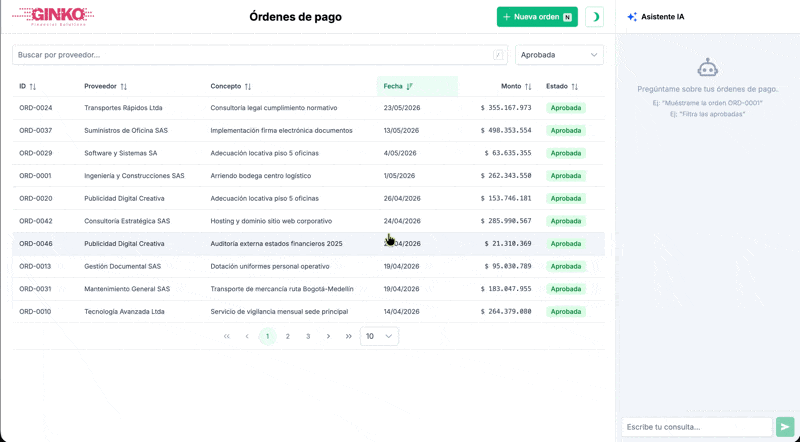
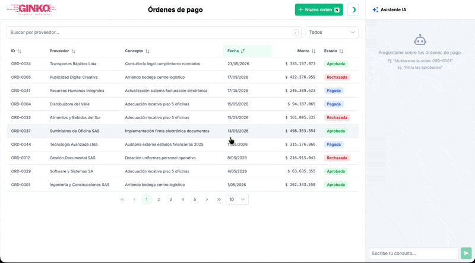
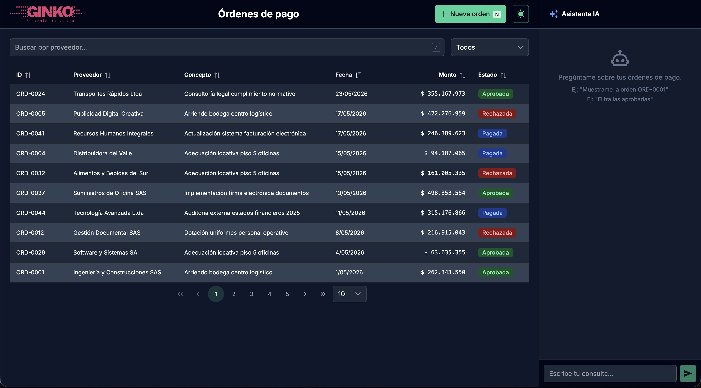
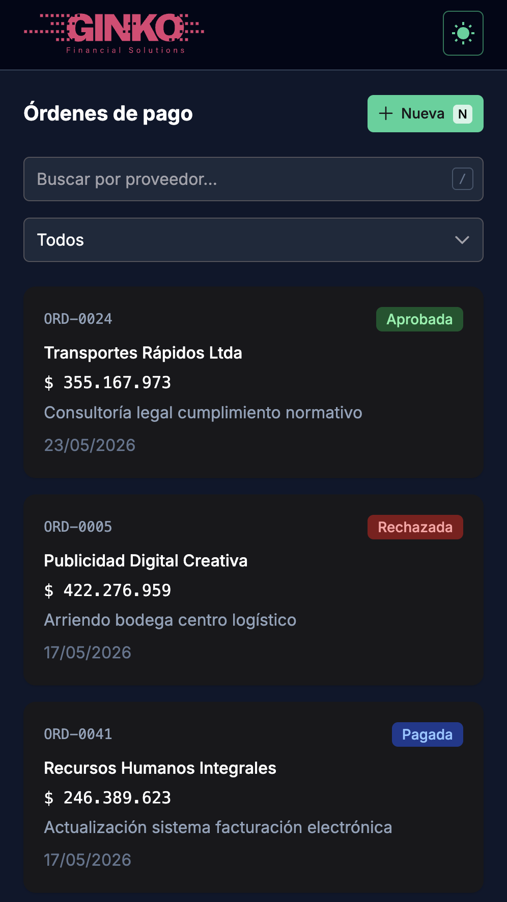

<div align="center">

# Ginko Payments

### Gestión inteligente de órdenes de pago a proveedores

[]()
[]()
[]()
[]()
[]()
[]()

[]()
[]()

**Prueba técnica — Ginko Financial Solutions** · Mayo 2026

</div>

---

## ✦ Overview

Ginko Payments es una SPA de gestión de pagos a proveedores construida con **Vue 3 + TypeScript**. Simula un entorno de banca empresarial con responsividad en mobile, tablet y desktop, con más de 50 órdenes semilla realistas.

---

## ✦ Demo rápida

```bash
# 2 comandos y ya está corriendo
npm install
npm run dev
# → http://localhost:5173
```

No necesitas backend, ni Docker, ni base de datos. MSW intercepta todas las llamadas a `/api/*` desde el Service Worker del navegador.

---

## ✦ Funcionalidades implementadas

### Bloque 1 · Listado de órdenes
| Funcionalidad | Estado |
|---|---|
| Tabla en desktop con todos los atributos | ✅ |
| Tarjetas apiladas en mobile | ✅ |
| Estados loading, error, vacío (componentes dedicados) | ✅ |
| Paginación servidor-consciente con controles | ✅ |

### Bloque 2 · Filtros
| Funcionalidad | Estado |
|---|---|
| Filtro por estado (todos, BORRADOR, APROBADA, RECHAZADA, PAGADA) | ✅ |
| Búsqueda por nombre de proveedor | ✅ |
| Filtros combinados en AND | ✅ |
| Sincronización con URL query params | ✅ |

### Bloque 3 · Formulario de creación
| Funcionalidad | Estado |
|---|---|
| Validaciones por campo (proveedor, monto, concepto) | ✅ |
| Contador de caracteres visible (250 max) | ✅ |
| Mensajes de error a nivel de campo | ✅ |
| Botón deshabilitado mientras inválido o enviando | ✅ |
| Redirección al listado tras éxito, sin recarga completa | ✅ |

### Bloque 4 · Detalle y transiciones
| Funcionalidad | Estado |
|---|---|
| Vista de detalle con toda la información | ✅ |
| Transiciones según reglas de negocio | ✅ |
| Confirmación modal antes de transicionar | ✅ |
| Manejo de error en transición | ✅ |
| Optimistic update para feedback inmediato | ✅ |

### Bloque 5 · Calidad transversal
| Funcionalidad | Estado |
|---|---|
| Componentes pequeños con responsabilidad única | ✅ |
| Uso consciente de estado local vs Pinia (ver Decisiones) | ✅ |
| Diseño responsivo (3 breakpoints) | ✅ |
| Pruebas unitarias (2 componentes, 11 tests) | ✅ |

### Bloque 6 · Extras
| Funcionalidad | Estado |
|---|---|
| Composable `useApi` (loading/error unificado) | ✅ |
| Optimistic updates | ✅ |
| Modo oscuro con toggle | ✅ |
| Transiciones suaves (modal) | ✅ |
| Atajos de teclado | ✅ |

---

## ✦ Capturas

### Desktop




### Mobile



---

## ✦ Stack tecnológico

| Herramienta | Versión | ¿Por qué? |
|---|---|---|
| **Vue 3** + Composition API | 3.5 | Reactividad granular, `<script setup>`, composables |
| **TypeScript** | 6.0 | Tipado estricto, autocompletado, documentación viva |
| **Vite** | 6.4 | Dev server inmediato, HMR instantáneo, build optimizado |
| **Pinia** | 3.0 | Estado global tipado, DevTools, modular por dominio |
| **Vue Router** | 4.5 | Lazy loading, query params reactivos |
| **Axios** | 1.7 | Interceptors, tipado de respuestas, más ergonómico que fetch |
| **PrimeVue** | 4.3 | DataTable con sort/filter/paginator integrados, componentes maduros |
| **Tailwind CSS** | 4.1 | Utilidades puras, sin componentes pesados, bundle mínimo |
| **MSW** | 2.7 | Intercepción de red sin servidor externo, ideal para demos |
| **Vitest** + VTU | 3.2 | Nativo de Vite, rápido, API idéntica a Jest |

### Decisiones de diseño

<details>
<summary><strong>🎯 Tailwind CSS en lugar de PrimeVue / Vuetify / Element Plus</strong></summary>

El enunciado pide **componentización clara** y **responsividad cuidada**. Las bibliotecas de componentes agregan 200-500KB de CSS no utilizado, estilos difíciles de sobrescribir y una capa de abstracción que oscurece la responsabilidad de cada componente. Tailwind permite construir componentes a medida de forma declarativa, con props explícitas y cero estilos muertos. En un entorno bancario, cada KB importa.
</details>

<details>
<summary><strong>🎯 PrimeVue para DataTable en lugar de tabla manual</strong></summary>

PrimeVue DataTable proporciona ordenamiento por columnas, filtros, paginación integrada y modo oscuro out-of-the-box. Reemplazar esto con una tabla manual habría requerido cientos de líneas de código adicional. Se eligió PrimeVue específicamente por su DataTable, y el resto de componentes (Tag, Dialog, InputText, Select, Button) se usan por consistencia visual. El bundle de PrimeVue se importa bajo demanda.
</details>

<details>
<summary><strong>🎯 MSW en lugar de json-server</strong></summary>

MSW (Mock Service Worker) intercepta las peticiones de red a nivel de Service Worker del navegador. Esto significa: **(a)** no hay que levantar un proceso backend separado, **(b)** la app funciona con un solo comando, **(c)** los mocks son código TypeScript que se versiona, y **(d)** se pueden simular delays, errores, y estados realistas. json-server requeriría `npm run dev` + `npm run api` y un puerto adicional.
</details>

<details>
<summary><strong>🎯 Axios en lugar de fetch nativo</strong></summary>

Axios provee transformación automática de JSON, interceptores para manejo global de errores, tipado de respuestas, y una API más legible para parámetros de query. El enunciado lo ofrece como opción y es el estándar en la industria financiera.
</details>

<details>
<summary><strong>🎯 Paginación del lado del servidor</strong></summary>

El mock de API recibe `?page=` y `?q=` y retorna solo 10 registros por página más el total. Elegí paginación servidora porque en banca empresarial real una tabla de pagos puede tener millones de registros — la paginación cliente no escala. El frontend nunca tiene más de 10 órdenes en memoria.
</details>

<details>
<summary><strong>🎯 Estado local vs Pinia (global)</strong></summary>

| Criterio | Pinia (global) | Local (composable/ref) |
|---|---|---|
| Órdenes (listado y detalle) | ✅ Se comparten entre vistas via `orderStore` | ❌ |
| Estado de carga/error de API | ✅ `listApi` y `detailApi` en store | ❌ |
| Formulario de creación | ❌ | ✅ `proveedor`, `monto`, `concepto` son transitorios |
| Filtros activos | ❌ | ✅ `useFilters` se sincroniza con URL |
| Tema oscuro | ❌ | ✅ `useDarkMode` es puramente visual |

</details>

---

## ✦ Arquitectura del proyecto

```
src/
├── api/
│   └── client.ts            # Axios instance + funciones tipadas (fetchOrders, createOrder, etc.)
│
├── components/
│   ├── ai/
│   │   └── AiAssistant.vue   # Chat conectado a DeepSeek
│   ├── orders/
│   │   ├── OrderTable.vue    # Vista desktop: tabla con todos los atributos
│   │   ├── OrderCard.vue     # Vista mobile: tarjetas apiladas
│   │   └── OrderFilters.vue  # Input búsqueda + select estado
│   ├── shared/
│   │   ├── StatusBadge.vue   # Indicador visual de estado (4 colores)
│   │   ├── ConfirmDialog.vue # Modal de confirmación reutilizable
│   │   ├── LoadingState.vue  # Spinner con mensaje
│   │   ├── ErrorState.vue    # Ícono de error con mensaje
│   │   ├── EmptyState.vue    # Indicador de lista vacía
│   │   └── AppHeader.vue     # Header con navegación y toggle dark mode
│   └── __tests__/
│       ├── StatusBadge.test.ts
│       └── OrderFilters.test.ts
│
├── composables/
│   ├── useApi.ts             # Manejo unificado de loading/error para promesas
│   ├── useFilters.ts         # Filtros reactivos sincronizados con URL query params
│   ├── useDarkMode.ts        # Toggle modo oscuro con clase .dark en <html>
│   └── useAi.ts              # Integración DeepSeek API (chat + suggestConcept)
│
├── mocks/
│   ├── handlers.ts           # 4 endpoints REST: GET list, GET detail, POST create, PATCH status
│   └── browser.ts            # Setup de MSW Worker
│
├── router/
│   └── index.ts              # 3 rutas con lazy loading
│
├── stores/
│   └── orderStore.ts         # Pinia store con optimistic updates
│
├── types/
│   └── order.ts              # Interfaces, constantes (STATUS_TRANSITIONS, LABELS, COLORS)
│
└── views/
    ├── OrderList.vue          # Listado + filtros + paginación + estados
    ├── OrderCreate.vue        # Formulario con validaciones
    └── OrderDetail.vue        # Detalle + transiciones + confirmación
```

---

## ✦ Primeros pasos

### Requisitos
- Node.js ≥ 20.18
- npm ≥ 10

### Instalación

```bash
# 1. Clonar
git clone <url-del-repositorio>
cd ginko-payments

# 2. Dependencias
npm install

# 3. (Opcional) API key de DeepSeek para el asistente IA
cp .env.example .env
# Editar .env con tu clave:
#   VITE_DEEPSEEK_API_KEY=sk-tu-clave
#   VITE_DEEPSEEK_MODEL=deepseek-v4-flash

# 4. ¡A volar!
npm run dev
```

Abrir `http://localhost:5173`. La app arranca con **53 órdenes de pago semilla** con datos colombianos realistas.

### Pruebas

```bash
npm test           # 11 tests, < 1 segundo
npm run test:watch # Modo desarrollo
```

### Build

```bash
npm run build      # → dist/
npm run preview    # Servir build local
```

---

## ✦ Pendientes y mejoras futuras

Lo que no se completó (con justificación) y cómo se abordaría con más tiempo:

| # | Pendiente | Prioridad | Por qué quedó fuera | Abordaje futuro |
|---|---|---|---|---|
| 1 | **Atajos de teclado** | Media | Requiere mapa de atajos y composable `useKeyboardShortcuts` que no interfiera con inputs | Composable con `onKeyDown` y hotkeys modales |
| 2 | **Animaciones en transiciones del listado** | Baja | El optimistic update ya da feedback inmediato; la animación extra es cosmética | `<TransitionGroup>` en OrderTable y OrderCard |
| 3 | **Modo oscuro persistente** | Baja | El toggle funciona en sesión pero no persiste | `localStorage` en `useDarkMode` |
| 4 | **Manejo de error granular** | Media | Los errores se muestran genéricamente | Mapeo de códigos HTTP a mensajes específicos por dominio |
| 5 | **Responsividad tablet** | Baja | Los breakpoints actuales (768px) funcionan, pero tablet podría beneficiarse de un nivel intermedio | Breakpoint `lg` adicional con layout híbrido |
| 6 | **Pruebas de integración** | Alta | Se priorizaron las unitarias por tiempo (11 tests en 2 componentes) | Cypress o Playwright para flujo crear → detalle → transicionar |

---

<div align="center">

**Construido con ❤️ para la prueba técnica de Ginko Financial Solutions**

Mayo 2026 · Bogotá, Colombia

</div>
